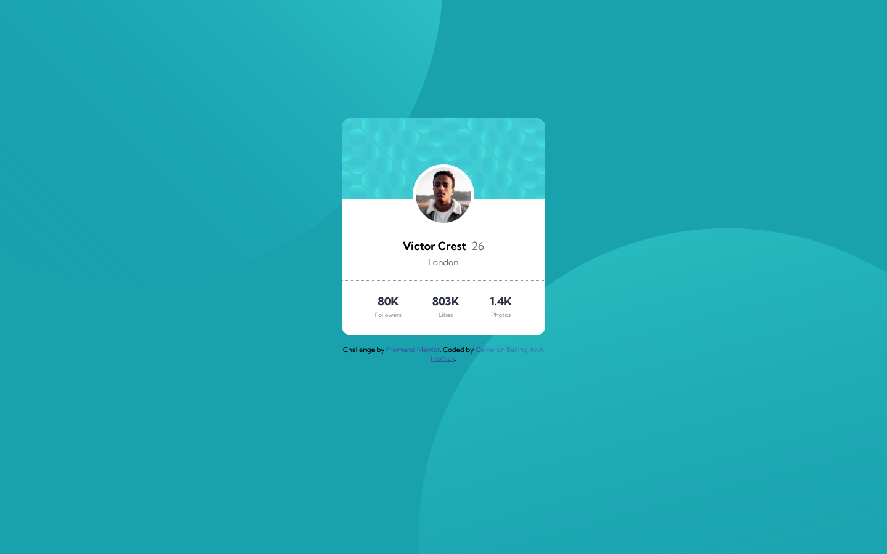
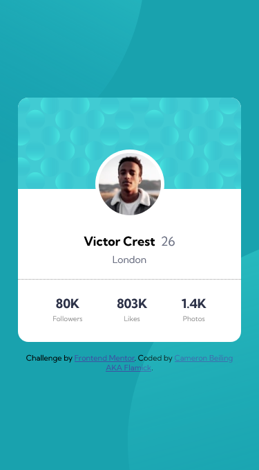

This is my solution to the [Profile card component challenge on Frontend Mentor](https://www.frontendmentor.io/challenges/profile-card-component-cfArpWshJ). Frontend Mentor challenges help you improve your coding skills by building realistic projects.

This challenge gave me a LOT of issues with the responsiveness of the background images. I had to add quite a bit of media queries to make it look good on most devices for both normal and landscape. I know I missed some devices and I know there's got to be an easier way to do this. Any feedback would be greatly appreciated

- Solution URL: [Frontend Mentor Solution](https://www.frontendmentor.io/solutions/html5-and-css-with-sass-to-compile-the-css-mv4WQBD_Y)
- Live Site URL: [Live Website](https://awesome-joliot-36899a.netlify.app/)

-  Mentor - [@Flamick](https://www.frontendmentor.io/profile/flamick)